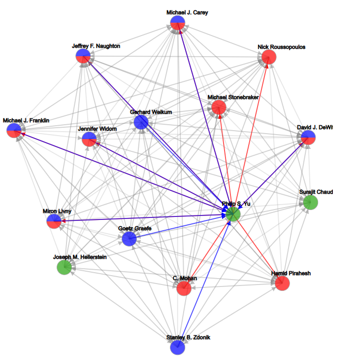

## QCQ-Viewer: A User-Friendly GUI for Mining and Browsing Quasi-Cliques in Directed Networks

## Abstract
Quasi-cliques are a type of dense subgraphs that generalize the
notion of cliques, important for applications such as community (or
module) detection in social (or biological) networks. While quasicliques are originally defined only for undirected graphs, we have
recently generalized the concept to directed graphs by proposing
(𝛾1,𝛾2)-quasi-cliques, which have density requirements in both
inbound and outbound directions of each vertex in a quasi-clique
subgraph. This generalization broadens application since many real
graphs are directed such as communication or citation networks,
and gene regulatory networks. We also proposed efficient parallel
algorithms with advanced pruning techniques to find maximal
(𝛾1,𝛾2)-quasi-cliques, paving the way for interactive mining (e.g.,
by tuning parameters such as 𝛾1 and 𝛾2) and result examination.
In this demonstration, we present a novel graphical user interface
on top of our mining program, called QCQ-Viewer, for users to
(1) mine maximal (𝛾1,𝛾2)-quasi-cliques of an input graph with an
interactive interface easy for parameter tuning, and to (2) examine
the resulting dense subgraphs in an aesthetically-pleasing manner
with the help of graph visualization functionalities

  

## YouTube Demo

Click on the image below to open the YouTube video

  

